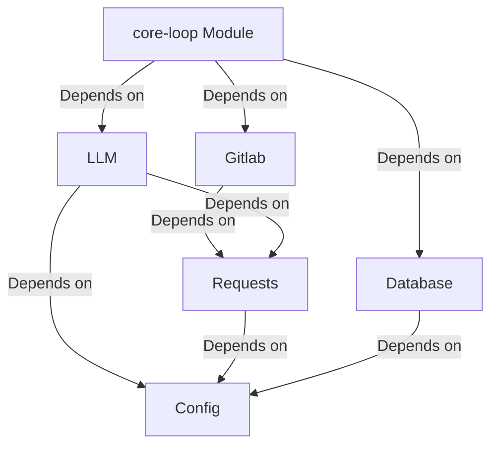
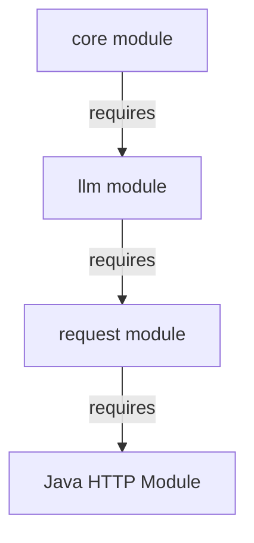

# Architecture

### core-loop
- **Description**: The `core-loop` module implements the core looping functionality.
- **Structure**:
  - `src/main/java`: Contains the main Java source files.
  - `src/test/java`: Contains test classes for the module.

### llm
- **Description**: The `llm` module provides functionalities related to large language models.
- **Structure**:
  - `src/main/java`: Contains the main Java source files.
  - `src/test/java`: Contains test classes for the module.

## As Built:
What Cursor came up with:
